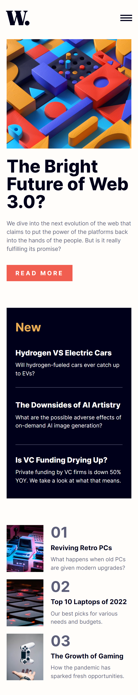

# News Homepage Frontend Challenge

Solution for the News Homepage challenge by Frontend Mentor. Create a responsive news homepage using HTML, CSS, and JavaScript.

## Features

- Responsive design
- Latest articles display
- Navigation bar
- Interactive elements

## Technologies

- HTML5
- CSS3
- JavaScript

## Getting Started

1. Clone the repository.
2. Open `index.html` in a web browser.

## Screenshots

| Desktop View                   | Mobile View                  |
| ------------------------------ | ---------------------------- |
|  |  |

## Author

[Tobi](https://github.com/purrrplelipton)

## Acknowledgments

Frontend Mentor community for feedback and support.

---
